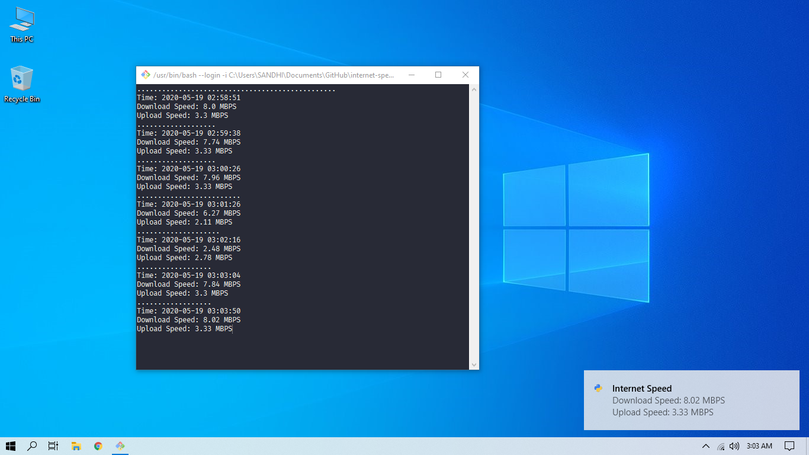

# Internet Speed Notifier
This app notifies the internet speed through voice and windows notification every n second. By default n=300.

Sometimes in a few cases where network speed fluctuates, it becomes necessary to get notified about the network speed with an interval of time.

Presently, I am staying in a developing country where broadband speed fluctuates a lot. The broadband connection is of 10 MBPS but sometimes it becomes 0.5 MBPS. So, it is important for me to get notified when the network speed becomes more than 5 MBPS so that I can work without trouble. This is the reason to build this app.

### Command Line Arguments
$ python app.py -h
usage: app.py [-h] [-d] [-dl] [-du] [-ul] [-uu] [-ns] [-nv] [-nt]

Network Speed Notifier

optional arguments:
*  -h, --help        show this help message and exit
*  -d , --delay      Delay in seconds for interval between tests
*  -dl , --dlower    Lower bound of download speed to get special notification
*  -du , --dupper    Upper bound of download speed to get special notification
*  -ul , --ulower    Lower bound of upload speed to get special notification
*  -uu , --uupper    Upper bound of upload speed to get special notification
*  -ns, --nospecial  Turn off the special notification
*  -nv, --novoice    Turn off the voice notification
*  -nt, --notoast    Turn off the Windows 10 toast notification

### Features
* Change options according to the CLA.
* Notify user about the network speed through voice
* Notify user about the network speed through Windows 10 toast notification

### Note
System must have [Git bash](https://git-scm.com/) to run this app in Windows 10

### Future Updates
* Send email when the speed is more than defined speed.
* Pass array of ssid to change if the present network is slow
* Change the network if the present network is slow, automatically revert to primary network e.g. broadband, when the expected speed is met.

### Screenshot

### Acknowledgement
* Notification tones downloaded from https://notificationsounds.com
